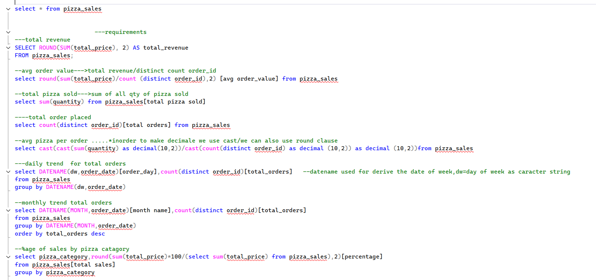
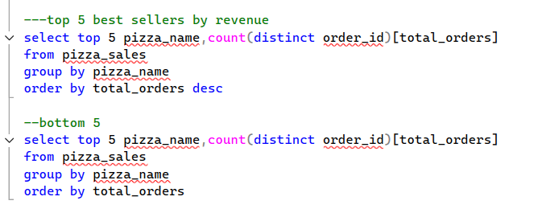

Pizza Sales Analysis Dashboard (Power BI)

Project Overview-
This project presents an interactive Pizza Sales Dashboard built using Power BI to analyze sales performance and customer ordering patterns in a pizza business.
The dashboard provides insights into revenue, order trends, best-selling pizzas, and category performance to support data-driven business decisions.

Objectives-
Analyze total revenue and sales performance.
Identify best-selling and worst-selling pizzas.
Understand sales trends by day and month.
Evaluate pizza category and size performance.
Track customer ordering patterns.
Provide interactive insights using Power BI visualizations.

Tools-
SQL,
Power BI Desktop,
Power Query ,
DAX,
Data Visualization & Dashboard Design.

KPIs-
Total Revenue,
Total Orders,
Total Pizzas Sold,
Average Order Value,
Average Pizzas per Order.

Dashboard Insights-
                     The dashboard helps answer important business questions such as:
Which pizza generates the highest revenue.
What are the top 5 best-selling pizzas.
Which pizzas perform the worst in sales.
Which pizza category contributes the most revenue.
What pizza sizes are ordered the most.
On which days and months sales peak.

Business Insights-
                 Some insights derived from the dashboard include:
Certain pizza categories generate significantly higher revenue.
Large-size pizzas contribute more to total sales.
Sales trends vary depending on day and time.
A small number of pizzas drive most of the revenue.

## 📊 Dashboard Preview

### Sales Overview Dashboard

### Best & Worst Seller Analysis

---

## 🗄️ SQL Analysis Queries

### Revenue, Orders & Sales Metrics

### Top & Bottom Selling Pizzas

